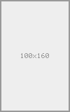
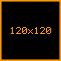
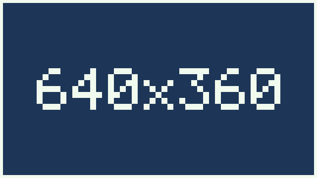

# Generated Images

Examples generated by the `placeholder-image` middleware.

## Portrait

`/placeholder/100x160.png`

## Square with Custom Colors

`/placeholder/120.png?bg=000&fg=f90`

## Widescreen with Custom Colors

`/placeholder/640x360.png?bg=1d3557&fg=f1faee`
